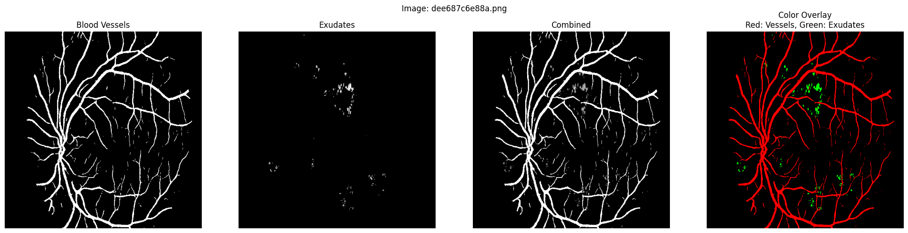

# Diabetic Retinopathy Classification using Combined Feature Segmentation

A machine learning pipeline that segments retinal features (blood vessels and exudates) from fundus images and combines them for multiclass diabetic retinopathy severity classification.

## Project Overview

This project implements a multi-stage approach to classify diabetic retinopathy (DR):

1. **Blood Vessel Segmentation** - Identifies and segments blood vessel networks in retinal images
2. **Exudate Segmentation** - Detects and segments exudates (lipid deposits) on the retina
3. **Feature Combination & Classification** - Combines segmented features and trains a CNN for DR severity classification

The final model classifies retinal images into 5 DR severity levels (0-4) using combined segmentation masks as input.



## Repository Structure

```
├── retina-blood-vessel-segmentation.ipynb     
├── exudates-segmentation.ipynb                
├── feature-combination-training.ipynb         
└── README.md                                  
```

## Key Components

### 1. Blood Vessel Segmentation (`retina-blood-vessel-segmentation.ipynb`)
- Explores vessel segmentation techniques
- Generates binary masks of retinal blood vessels
- Outputs vessel segmentation for each retinal image

### 2. Exudate Segmentation (`exudates-segmentation.ipynb`)
- Segments hard exudates from retinal images
- Creates binary masks highlighting lipid deposits
- Provides exudate segmentation masks for combination

### 3. Feature Combination & Classification (`feature-combination-training.ipynb`)

#### Feature Combination Strategy
The pipeline combines blood vessel and exudate segmentations into a single RGB representation:
- **Red Channel**: Blood vessel segmentation
- **Green Channel**: Exudate segmentation
- **Blue Channel**: Empty (reserved for future features)

This color-coded combination allows the model to learn relationships between different retinal features.

#### Classification Architecture

**RetinaCNN Model:**
- **Input**: 224×224 RGB combined segmentation images
- **Architecture**: 4-layer convolutional network with batch normalization and max pooling
- **Output**: 5-class probability distribution (DR severity levels 0-4)


## Data Pipeline

### Input
- Kaggle APTOS 2019 dataset with DR severity labels (0-4)
- Segmented blood vessel masks
- Segmented exudate masks

### Processing
1. Load segmentation masks for blood vessels and exudates
2. Find matching images between both segmentation datasets
3. Combine segmentations into single RGB image with color coding
4. Split into training (80%) and validation (20%) sets with stratification

### Output
- Combined segmentation images (RGB PNG format)
- Trained classification model
- Performance metrics and confusion matrix


### Key Dependencies
- PyTorch, TorchVision and TensorFlow 
- scikit-learn 
- pandas 
- Pillow,CV2
- NumPy & SciPy 
- Matplotlib & Seaborn 
- Kagglehub 


## Training Configuration

- **Batch Size**: 32
- **Learning Rate**: 0.001
- **Optimizer**: Adam
- **Loss Function**: Cross Entropy Loss
- **Epochs**: 20
- **Image Size**: 224×224
- **Train/Val Split**: 80/20 with stratification

### Data Augmentation (Training Only)
- Horizontal flip
- Random rotation (±10°)
- Normalized with ImageNet statistics


## Key Insights

- Combining blood vessel and exudate segmentations provides complementary information for DR classification
- Color-coded RGB representation allows the CNN to learn feature-specific patterns
- Binary segmentation masks reduce image complexity and highlight pathological features
- Stratified train/val split ensures balanced class distribution

## Future Improvements

- Implement attention mechanisms to weight feature importance
- Explore ensemble methods combining multiple segmentation models
- Add hard example mining for challenging misclassifications
- Implement class-weighted loss to handle class imbalance
- Test transfer learning with pre-trained backbone networks
- Add interpretability analysis (GradCAM) to visualize important regions

